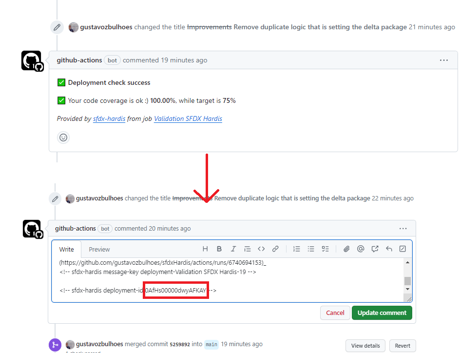

# Salesforce CI/CD Project:

This repository contains the source code for a custom CI/CD process for Salesforce using Github Actions combining:
 - [Pablo Gonzales ideias](https://www.pablogonzalez.io/)
 - [sfdx-hardis](https://sfdx-hardis.cloudity.com/)

## How does it works:

- When a PR is created from a feature branch to the main branch the [pr-validation.yml](https://github.com/gustavozbulhoes/sfdxHardis/blob/main/.github/workflows/pr-validation.yml) workflow runs and validates the selected tests from the PR Body. If "all tests" is used, the quick deploy Id is saved in the PR Status result comment (see picture).

- When the PR is merged the [pr-deploy.yml](https://github.com/gustavozbulhoes/sfdxHardis/blob/main/.github/workflows/pr-deploy.yml) workflow runs deploying it to production by executing the Quick Deploy (if available) or the standard deploy respecting selected tests (if quick deploy is not available).
- The pr-validation and pre-deploy workflow logics are very similar, both use Node.js to read the tests to run from PR body based on [this article](https://www.salesforceben.com/build-your-own-ci-cd-pipeline-in-salesforce-using-github-actions/). After that, the validation or deploy is executed using [sfdx-hardis](https://sfdx-hardis.cloudity.com/) plugin (Quick Deploy feature).
- Destructives are deployed as an exclusive async destructive package and the destructive deploy Id is available in the action history (see result details in Salesforce>Setup>Deployment Status).
